# kantan.dot

I use [Graphviz](https://graphviz.org/download/) quite a bit to diagram things. It's a great tool, and has saved me many hours of obsessing over whether something should be one more pixel to the left.

Like all quality software, it has a few flaws. kantan.dot is about addressing the one that frustrates me the most: the absence of external stylesheets.

kantan.dot takes a rather naive approach that seems to fit my use case perfectly: stylesheets are simple class to attributes mapping; any diagram element that has the right class(es) inherits the corresponding attributes.

## Documentation

Since I don't expect kantan.dot to gain any sort of traction, I won't spend too long documenting it. The following examples should be enough to work most things out.


### Stylesheet
```css
/* Sets the color of all nodes to red... */
node {
  color: red;
}

/* ... except for those with class "white", which will be white.
 * The general rule is that the most specific selection wins:
 * node.white is more specific than node, so it wins in case of
 * conflicting values.
 */
node.white {
  color: white;
}

/* Edges are styled with the "edge" keyword, and work exactly the same
 * way as nodes.
 */
edge.green {
  color: green;
}

/* Same goes for graphs. kantan.dot does not (yet?) make a distinction
 * between root graph, subgraph and cluster.
 */
graph.yellow {
  bgcolor: yellow;
}

/* You can omit the element type if you want a rule to match all of them.
 * This applies to graphs, edges and nodes:
 */
.transparent {
  bgcolor: transparent;
}
```

### DOT

```dot
digraph {
    // Classes are set as comma-separated values to the "class" attribute.
    a[class="red,disabled"]

    // Attributes specified in an element override those derived from a
    // stylesheet. This node will be purple, even though the stylesheet
    // says it should be white:
    b[class="white" color="purple"]
}
```


Do note that the output of kantan.dot will very likely look nothing like your original DOT input. It should in theory be *equivalent*, but DOT turned out to be far weirder a format than I was expecting
and kantan.dot has a very simplified in-memory representation. It's easy to go from the actual DOT grammar to kantan.dot's internal representation, but it's a lossy transformation and it's impossible to
get back to the original input.

## Running kantan.dot
### As an SBT task
Since I wrote kantan.dot to be part of my slides workflow, it's mostly meant to be an SBT task.

The most basic plugin is enabled with the following line in `project/plugins.sbt`:

```sbt
addSbtPlugin("com.nrinaudo" % "kantan.dot-sbt" % "x.y.z")
```

This defines:
* `graphvizSourceDirectory`: source directory for DOT files (defaults to `./src/main/graphviz`).
* `graphvizTargetDirectory`: target directory for compiled DOT files (defaults to `./target/scala-2.12/graphviz`).
* `graphvizStylesheet`: path to the stylesheet to apply (defaults to none).
* `graphviz`: tasks that compiles all DOT files found in `graphvizSourceDirectory` to SVG files.

The way I use kantan.dot is mostly in conjunction with [sbt-site](https://github.com/sbt/sbt-site), which is why
there's another plugin to integrate both of them:

```sbt
addSbtPlugin("com.nrinaudo" % "kantan.dot-sbt-site" % "xyz")
```

This takes care of hooking things together so that running `makeSite` will automatically compile DOT files and
copy the output to the site's `img` directory (this can be configured by changing `Graphviz / siteSubdirName`).

### As a library

The code should be relatively straightforward to follow. Here's a simple use case to get you started:

```scala
import kantan.dot._
import java.io.File

val graphFile: File = ???
val styleFile: File = ???

// Loads a graph and stylesheet, applies the later to the former, and prints the result to stdout.
for {
  graph      <- Parse.parse[Graph](graphFile)
  stylesheet <- Parse.parse[Stylesheet](styleFile)
} Print.print(stylesheet.applyTo(graph))
```

### As a CLI

kantan.dot comes with a simple CLI. By far the easiest way to access it is via [coursier bootstraping](https://get-coursier.io/docs/cli-bootstrap):

```shell
# I call it dss but call it whatever you want, you're probably the only other user in the world
# anyway, your naming conventions are as relevant as mine.
coursier bootstrap com.nrinaudo::kantan.dot-cli:x.y.z -o dss
```

Here's how to use it:

```shell
dss x.y.z
Usage: dss [options]

  -s, --style <value>   stylesheet to apply
  -i, --input <value>   DOT file to apply style to
  -o, --output <value>  where to write the resulting DOT content (defaults to STDOUT)
  --help
  --version
```

## Known limitations
kantan.dot does not currently support HTML strings, because I never use them and they do *not* look like a fun parsing exercise.

## Possible evolutions

* support for identifier-based selectors (a bit like CSS's `#foo`)
* support for attribute-based selectors (`node.white[bgcolor=red] { ... }`)
* I'm pretty sure string escaping is not handled properly, and line breaks in quoted strings is unlikely to behave right. Fix this.
* support for more formats than just SVG in the SBT task.
